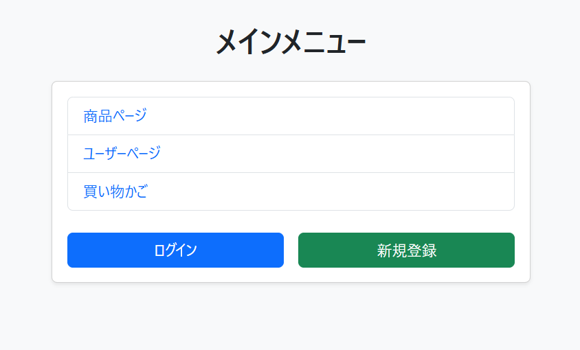
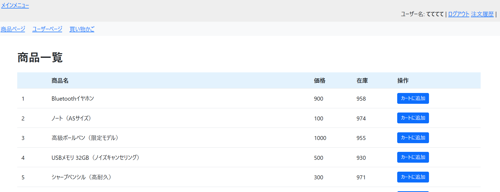

# Webアプリケーション（Spring Boot × PostgreSQL）

## 概要
このアプリケーションは、Spring Boot と PostgreSQL を使用した Web アプリです。  
ユーザー、商品、注文、注文詳細を管理するシンプルな EC 風の構成になっています。

## 使用技術
- Java / Spring Boot
- PostgreSQL
- Docker（PostgreSQL 実行環境）
- Thymeleaf（テンプレートエンジン）
- Bootstrap

## データベース構造
- users：ユーザー情報
- item：商品情報
- orders：注文情報
- order_item：注文と商品を紐づける中間テーブル

## 初期データについて
`src/main/resources/data.sql` に初期データを含めています。  
アプリ起動時に自動でデータが投入されるため、追加操作は不要です。

## 起動方法
1. PostgreSQL を起動（Docker など）
2. `test-db` データベースを作成
3. Spring Boot を起動

## ブランチ構成
- main：完成版
- feature/〇〇 ←記載された機能の実装ブランチ

  
## 画面イメージ
# トップ画面

# 商品一覧
